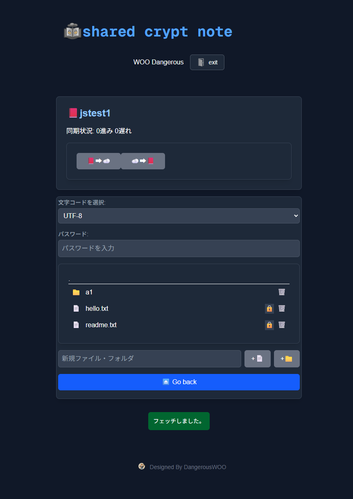

## SharedCryptNote
SharedCryptNote is a secure, web-based encrypted note-taking application. It uses the Blowfish encryption algorithm to securely store your notes and manages them efficiently within a file system. It is also compatible with the Android application "SharedKeyMemo," ensuring a seamless note-taking experience across your devices.

https://play.google.com/store/apps/details?id=org.dwmedia.sharedkeymemo



## Key Features
Strong Encryption

Uses the Blowfish algorithm to keep your notes safe and secure.

Google Account Integration

Easily log in using your existing Google account.

Git Version Control

Each note is managed with Git, allowing you to track changes and revert to previous versions.

Multi-Device Compatibility

Compatible with the Android app SharedKeyMemo, enabling you to share and edit the same notes between your PC and smartphone.

Tech Stack
Frontend: Next.js

Encryption: Blowfish

Version Control: Git

Authentication: Google Account Integration

## Google AUTH
.env.local
```bash
# NextAuth.js のセッションを暗号化するための秘密鍵です。任意の文字列で構いません。
NEXTAUTH_SECRET=UUID

# Google Cloud Platform で取得した Client ID
GOOGLE_CLIENT_ID=

# Google Cloud Platform で取得した Client Secret
GOOGLE_CLIENT_SECRET=

# Callback URL (http://localhost:3000/api/auth/callback/google)
NEXTAUTH_URL=https://sharednote.hoge.com
```

## Getting Started
First, run the development server:

```bash
npm run dev
# or
yarn dev
# or
pnpm dev
# or
bun dev
```

Open [http://localhost:3000](http://localhost:3000) with your browser to see the result.

You can start editing the page by modifying `app/page.tsx`. The page auto-updates as you edit the file.

This project uses [`next/font`](https://nextjs.org/docs/app/building-your-application/optimizing/fonts) to automatically optimize and load [Geist](https://vercel.com/font), a new font family for Vercel.

## Learn More

To learn more about Next.js, take a look at the following resources:

- [Next.js Documentation](https://nextjs.org/docs) - learn about Next.js features and API.
- [Learn Next.js](https://nextjs.org/learn) - an interactive Next.js tutorial.

You can check out [the Next.js GitHub repository](https://github.com/vercel/next.js) - your feedback and contributions are welcome!

## Deploy on Vercel

The easiest way to deploy your Next.js app is to use the [Vercel Platform](https://vercel.com/new?utm_medium=default-template&filter=next.js&utm_source=create-next-app&utm_campaign=create-next-app-readme) from the creators of Next.js.

Check out our [Next.js deployment documentation](https://nextjs.org/docs/app/building-your-application/deploying) for more details.

